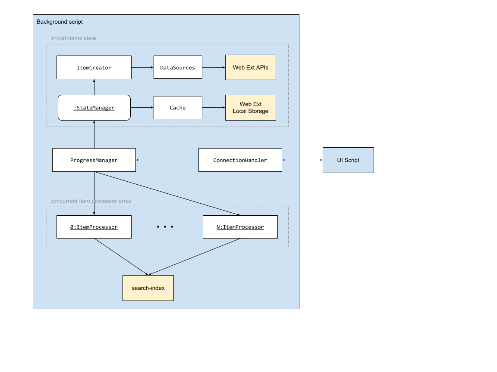

## `imports` Feature Module

### Purpose

- converting browser history and bookmarks into import items
- managing and persisting import items state
- downloading and processing import items and sending results to `search-index` feature module
- afford external progress and choice controls

### How it works

#### Rough arch overview:

[source](https://docs.google.com/document/d/1hT3sSc_MaHdREilBoekOvJJMvGpRYWL_zAjK3lWu1sA/edit?usp=sharing)



Imports is made up of a number of different modules with different responsibilities.

An instance of `StateManager` acts as a singleton in the background script.
It acts as a source of import items, backed by a `Cache` instance which will handle persisting items in dynamically allocated chunks
stored under local storage keys. It will interact with `ItemCreator` if the cache misses
to handle deriving new import items from given `DataSource` instance (wraps the Web Ext `history` and `bookmarks` APIs).

An instance of `ConnectionHandler` will be created whenever the UI script creates a connection
(user first installs or goes to imports page). This will handle a number of special commands that
are sent over a [`runtime.connect()` connection](https://developer.mozilla.org/en-US/Add-ons/WebExtensions/API/runtime/connect) to afford control over
imports progress and various options.

`ConnectionHandler` delegates control to its `ProgressManager` instance to handle the
progress state (whether it is running, etc.), and iterating through chunks of import items
provided by the `StateManager` instance when running. An array of `ItemProcessors`
are maintained - length will be equal to concurrency setting - to which import items within
the current chunk will be distributed: 1 item per processor. Once a chunk is depleted,
the next chunk will be requested from the cache. When all chunks are depleted, a "complete"
command will be sent to the UI and progress will end.

An instance of `ItemProcessor` handles processing import items. Processing includes
downloading of the page data at the given URL via [`fetch-page-data` module](https://github.com/WorldBrain/Memex/blob/master/src/page-analysis/background/fetch-page-data.js),
getting any visit or bookmark timestamps using the given browser ID, and sending
and waiting on a request to the search index to preprocess and index the data.

#### Import item shape

```ts
// History or bookmark
type ImportItemType = 'h' | 'b';

interface ImportItem {
    type: ImportItemType; // Used for switching `ImportItemProcessor` logic
    browserId: number; // Used for visit times lookup (browser-tracked)
    url: string; // Will be used for download
}
```
